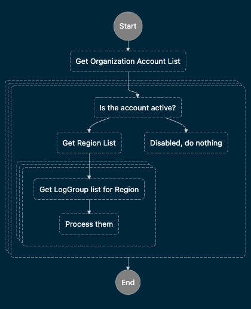

Deploy as a Stack in the Organization account, in the main region.

The template has two parameters:

- <b>OrgAccountId</b> - the account number of the main organisation account
- <b>CrossAccountRole</b> - the role to assume in member accounts. If you're running under AWS Control Tower, use <tt>AWSControlTowerExecution</tt>. If running under AWs Organizations without Control Tower, use <tt>OrganizationAccountAccessRole</tt>.

Logic:

[](docs/flowchart.png)

The Step Function state machine is triggered at 00:00 UTC every day. It will retrieve the list of accounts in the organisation, including the root account. Then, it will process each account in parallel, skipping disabled accounts.

For each active account, it will fetch the list of regions to which the account has access (this might vary due to opt-in requirements).

Then, in parallel for each region where opt-in isn't required, it will fetch the list of log groups in that account and region. For each log group without an explicit retention time, it will set retention to 14 days.


## Deployment

First log in to your AWS organisation using SSO and a profile that gives you
AWSAdministratorAccess to the AWS Organizations admin account.

```console
aws sso login --profile <profile-name>
```

Then type:

```console
./deploy-all
```
